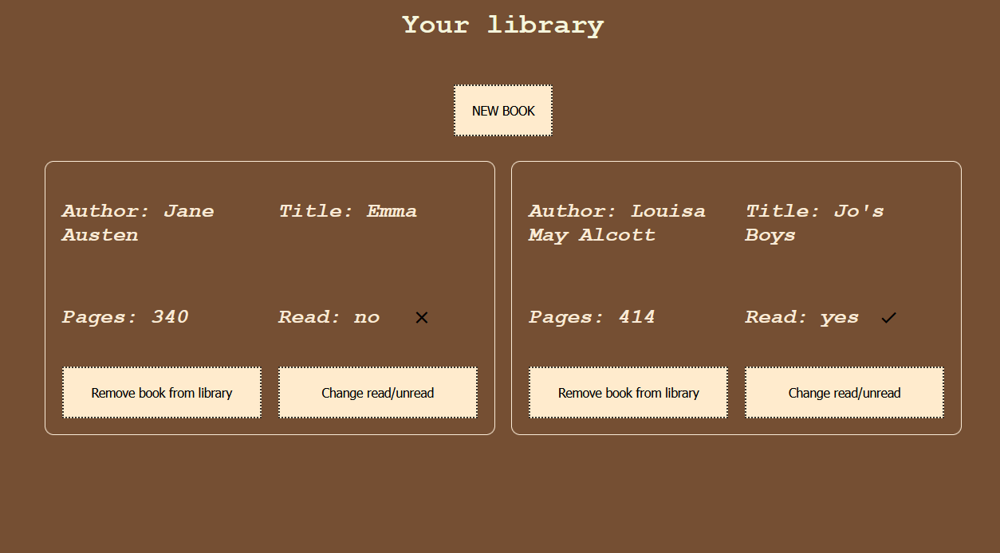

# Library app

This project uses HTML, CSS and Javascript to create a library app. Users can add books to their library, remove books and update read status.

Note: Books added to library are not stored and will disappear after refresh.

## The Odin Project: Lesson Library

This project is build according to the specification of the [Library lesson](https://www.theodinproject.com/lessons/node-path-javascript-library)

## Live website

Access the [Library App](https://gohan61.github.io/Library-project/)

